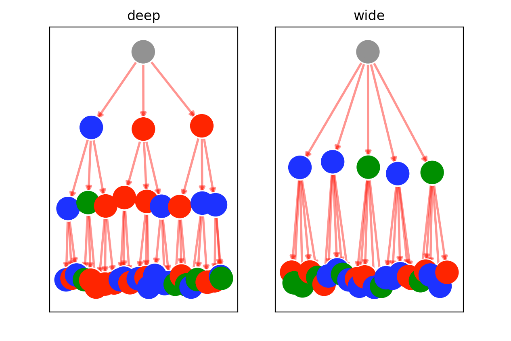
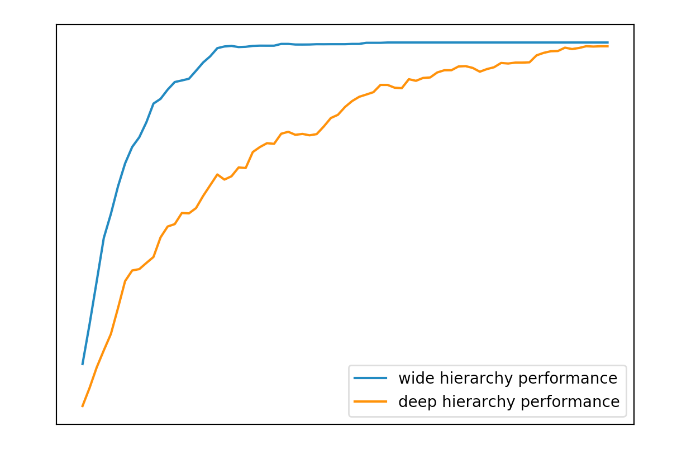

# Örg Ås Board
Graph based Conway's Game of Life for Organizations

Began as a curiosity how the Game of Life would look re-imagined as a network
or graph.
As a starting point have choosen to investigate hierarchies / organizations to
visualize how different nodes interact through the network. To see how simple
rules for nodes can be modelled over time and the effect they can have.

For example here's an experiment comparing the performance of wide organizations
versus deep organizations:

## Development

### Setup

    python3.6 -m venv env
    source env/bin/activate
    pip install -r requirements.txt

### Running

    source env/bin/activate
    export MPLBACKEND="module://itermplot"
    python examples/basic3x3.py

### Storing updates

    pip freeze > requirements.txt

## Testing

As the project in very much in the design phase just use integration tests
such as the examples.

    pytest

## Run notebooks

    PYTHONPATH=$PWD:$PYTHONPATH jupyter notebook --notebook-dir=notebooks/

## TODO:

Would like to
- complete an interesting hierarchial/DAG model based on current work
- a completely different 3D general graph of nodes appearing/disappearing
